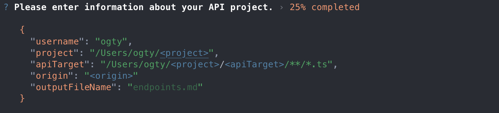
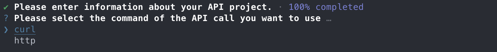
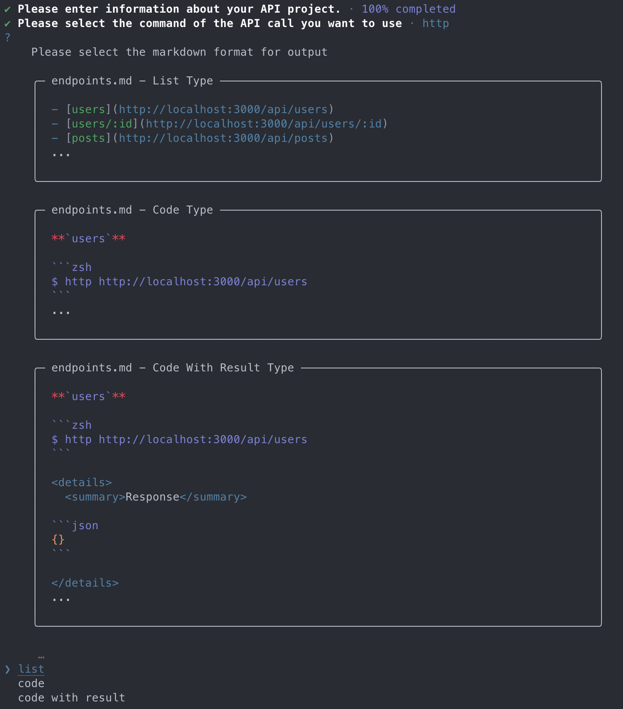

<h1 align="center">🧪 Command Line API Testing Tools</h1>

```zsh
$ npm install --global api-endpoint-tester
```

```zsh
$ api-tester init
```






```zsh
$ api-tester setParams
```


```zsh
$ api-tester generate [select]
```

> **Note**<br>
>
> - Mac users only.
> - The `/Users/<username>/api-tester-settings.json` file will be created.
